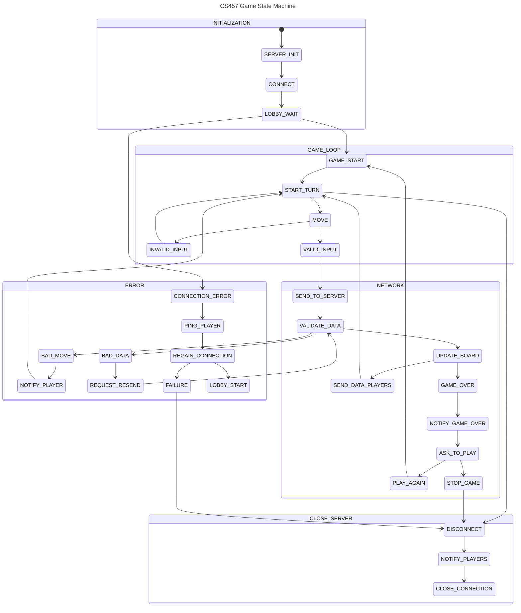

```mermaid
---
title : CS457 Game State Machine
---


stateDiagram
  direction TB
  
  state INITIALIZATION{
  %% Server starts
  [*] --> SERVER_INIT

  %% Player's connect  
  SERVER_INIT --> CONNECT
  
  CONNECT --> LOBBY_WAIT
  LOBBY_WAIT --> GAME_START

  LOBBY_WAIT --> CONNECTION_ERROR

  }

  state GAME_LOOP {
  
  PLAY_AGAIN --> GAME_START
  GAME_START --> START_TURN
  NOTIFY_PLAYER --> START_TURN
  INVALID_INPUT  --> START_TURN

  START_TURN --> DISCONNECT

  START_TURN --> MOVE
  MOVE --> INVALID_INPUT
  MOVE --> VALID_INPUT

  VALID_INPUT --> SEND_TO_SERVER

  SEND_DATA_PLAYERS --> START_TURN

  }

  state NETWORK {
    REQUEST_RESEND --> VALIDATE_DATA
    SEND_TO_SERVER --> VALIDATE_DATA

    %% Bad move will only notify original player to restart their turn
    VALIDATE_DATA --> BAD_MOVE
    VALIDATE_DATA --> BAD_DATA
    VALIDATE_DATA --> UPDATE_BOARD

    UPDATE_BOARD --> GAME_OVER
    GAME_OVER --> NOTIFY_GAME_OVER
    NOTIFY_GAME_OVER --> ASK_TO_PLAY
    ASK_TO_PLAY --> PLAY_AGAIN
    

    ASK_TO_PLAY --> STOP_GAME
    STOP_GAME --> DISCONNECT

    UPDATE_BOARD --> SEND_DATA_PLAYERS    
    
  }

  state ERROR{
    BAD_MOVE --> NOTIFY_PLAYER
    BAD_DATA --> REQUEST_RESEND

    CONNECTION_ERROR --> PING_PLAYER
    PING_PLAYER --> REGAIN_CONNECTION
    REGAIN_CONNECTION --> FAILURE
    FAILURE --> DISCONNECT

    REGAIN_CONNECTION --> LOBBY_START
  }

  state CLOSE_SERVER{
    DISCONNECT --> NOTIFY_PLAYERS
    NOTIFY_PLAYERS --> CLOSE_CONNECTION
  }
```
